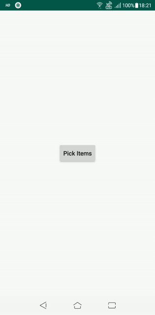

# FilterCheckPicker
[](https://android-arsenal.com/api?level=21) [](https://www.jitpack.io/#debojyoti452/FilterCheckPicker) [](https://www.codacy.com/manual/debojyoti452/FilterCheck?utm_source=github.com&amp;utm_medium=referral&amp;utm_content=debojyoti452/FilterCheck&amp;utm_campaign=Badge_Grade)

## Version
#### Tag = 1.1.0
## Sample
<p align="center"> 

</p>

## Description
<b>If you use these library your life will get little easier. It can be used for picking multiple items and get the result back as an arraylist. You can use it in your contact list or spinner data, it can be customized as you want it.</b>

## Requirement
* Must use AndroidX
* Kotlin Supported

## Installation
#### Project Level Gradle
```java
allprojects {
		repositories {
			maven { url 'https://www.jitpack.io' }
		}
	}
```
#### App Level Gradle
```java
dependencies {
	        implementation 'com.github.debojyoti452:FilterCheckPicker:Tag'
	}
```

## Code Sample
#### Code Implementation
* Declare the Variables. <b>Please note that, pass only ItemListModel class, it will take only string name.</b>
```kotlin
    private var REQUEST_CODE = 5
    private var listItem: ArrayList<ItemListModel> = ArrayList()
    private var selectedList: ArrayList<ItemListModel> = ArrayList()
```
* Generate the data for list items or you can simply fetch it from you server or database.
```kotlin
    private fun generateListItem(): ArrayList<ItemListModel> {
        val list: ArrayList<ItemListModel> = ArrayList()
        list.add(ItemListModel("Sun"))
        list.add(ItemListModel("Mercury"))
        list.add(ItemListModel("Venus"))
        list.add(ItemListModel("Earth"))
        list.add(ItemListModel("Mars"))
        list.add(ItemListModel("Jupiter"))
        list.add(ItemListModel("Saturn"))
        list.add(ItemListModel("Neptune"))
        list.add(ItemListModel("Uranus"))
        list.add(ItemListModel("Pluto"))
        return list
    }
```
* Pass the Activity Context or Fragment Context through the builder method.
```kotlin
button!!.setOnClickListener {
            listItem = generateListItem()
            FilterCheckPicker.Builder(this)
                .setLists(listItem)
                .setLimitsOfSelections(3)
                .GetPickerForResult(REQUEST_CODE)
        }
```
* Get the result by calling onActivityResult method
```kotlin
override fun onActivityResult(requestCode: Int, resultCode: Int, data: Intent?) {
        super.onActivityResult(requestCode, resultCode, data)
        if (requestCode == REQUEST_CODE && resultCode == Activity.RESULT_OK && data != null && data.extras != null) {
            selectedList = data.getSerializableExtra(SelectObjectListActivity.RESULT_SELECTED_LIST_KEY) as ArrayList<ItemListModel>

            for (i in 0 until selectedList.size){
                Log.d("GotList", selectedList[i].getNameList())
            }

        } else {
            throw Exception("Not get any data..")
        }
    }
```

## Method Showcase
* setLists - call this method to pass the item list. 
* setLimitsOfSelections - call this method to pass the limit for selection. Default value is 3
* GetPickerForResult - call this method to pass the Integer requestCode

## License
>GNU General Public License v3.0
Permissions of this strong copyleft license are conditioned on making available complete source code of licensed works and modifications, which include larger works using a licensed work, under the same license. Copyright and license notices must be preserved. Contributors provide an express grant of patent rights.

## Contribution
Feel free to pull request.

Find this library useful? ❤️
Support it by joining stargazers for this repository. ⭐️
